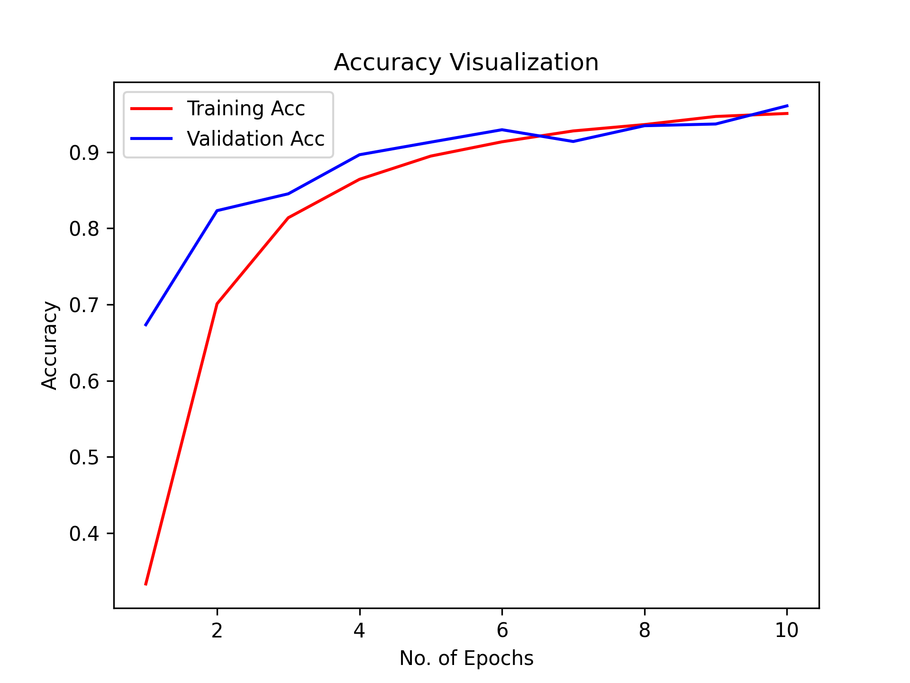
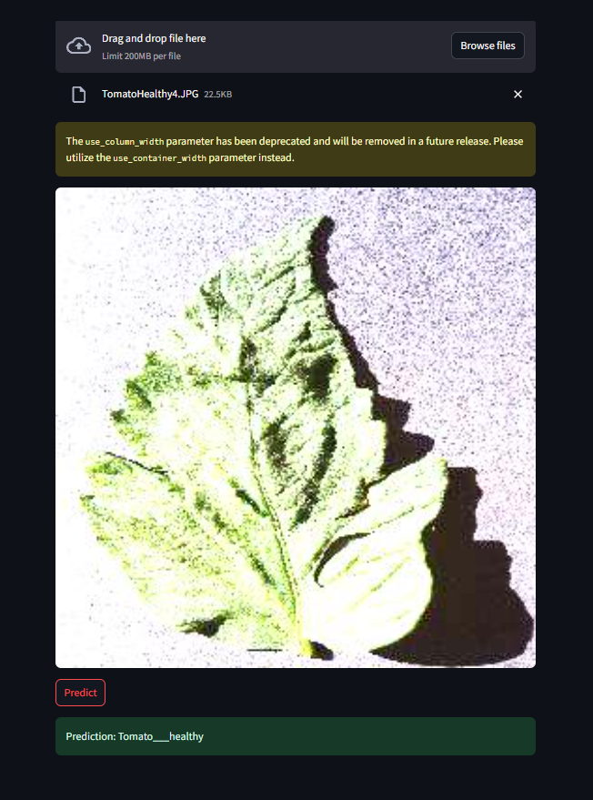
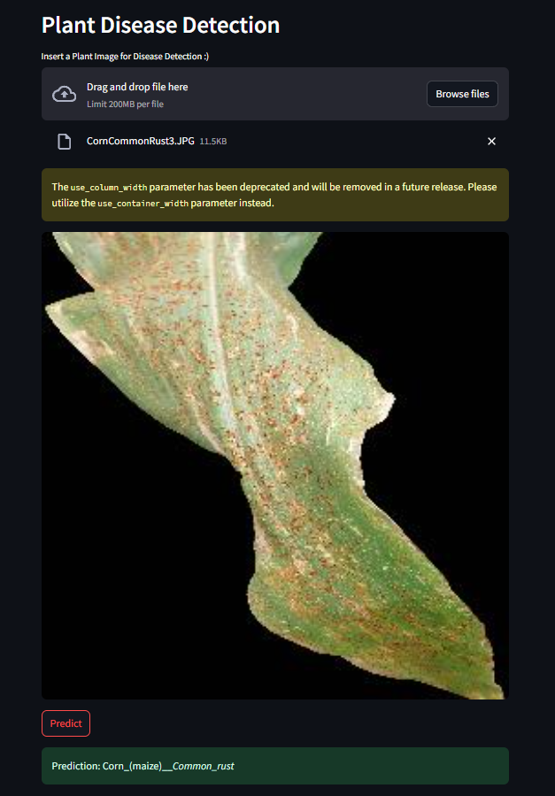

# 🌿 Plant Disease Detection System using TensorFlow and Streamlit

A deep learning-based web app that identifies plant leaf diseases using images. Built with **TensorFlow** and **Streamlit**, it helps detect 38 types of plant diseases and healthy conditions using a Convolutional Neural Network (CNN).

---

## Project Overview

This project aims to assist farmers, researchers, and gardeners in identifying plant diseases through image classification. It uses a custom-trained CNN on an augmented dataset of plant leaves.

---

## Model Architecture

The model is a deep CNN with the following structure:

- 5 convolutional blocks (filters: 32 → 512)
- MaxPooling2D after every 2 conv layers
- Dropout layers to prevent overfitting
- Dense layers:
  - Fully connected (1500 units)
  - Softmax output for 38 categories

### Performance:
Training Accuracy:    97.5% 
Validation Accuracy: 96.0% 

---

## Dataset

- Source: `New Plant Diseases Dataset (Augmented)`
- Training images: 70,295  
- Validation images: 17,572  
- Total Classes: 38 (e.g., `Tomato___Late_blight`, `Apple___healthy`, etc.)

---

## Streamlit App Overview

The app allows users to upload an image of a plant leaf and instantly receive the predicted disease class.

---

## Setup & Run the App

1️⃣ **Install dependencies** (recommended inside a virtual environment):
```bash
pip install -r requirements.txt
```

then in activated env run the following code in cmd,
```bash
streamlit run app.py
```

## 📈 Model Results

### Accuracy Plot  


### Classification Report Highlights

- Apple___Apple_scab: Precision 0.99, Recall 0.94, F1-score 0.96 (Support: 504)  
- Apple___Black_rot: Precision 0.98, Recall 0.96, F1-score 0.97 (Support: 497)  
- Apple___Cedar_apple_rust: Precision 0.99, Recall 0.97, F1-score 0.98 (Support: 440)  
- Apple___healthy: Precision 0.96, Recall 0.92, F1-score 0.94 (Support: 502)  
- Blueberry___healthy: Precision 0.96, Recall 0.97, F1-score 0.97 (Support: 454)  
- Cherry_(including_sour)___Powdery_mildew: Precision 0.99, Recall 0.99, F1-score 0.99 (Support: 421)  

*Full classification report available in the project folder.*

---

## 🖼️ Demo Screenshots

Below are example outputs from the Streamlit app showing disease predictions on uploaded leaf images:

-   
-   
